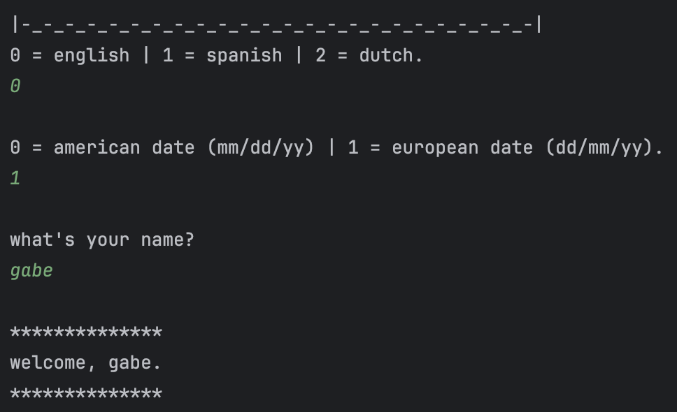
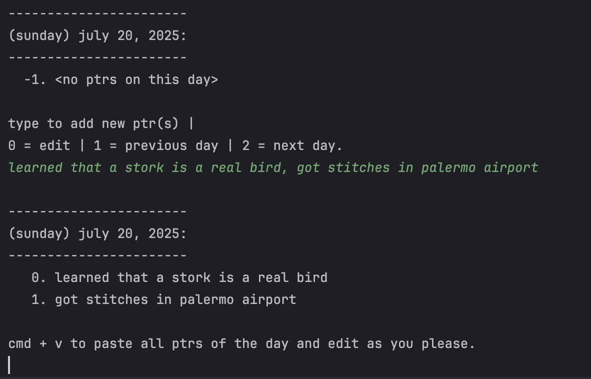

# ptrs

## hstry
in one of my first compsci classes, i learned about a memory pointer: a small 8byte address in memory that can be used to access a theoretical infinite amount of memory. always having written small little things down to help me organize and remember things that i did/watched/learned/felt/etc, i realized that human memory works similarly. active and unprovoked recall is extrememly different, but with a small reminder of a certain event/person/video/game/etc, memories come flooding back. i have since been developing a program to help me more intentionally and efficiently structure all of my so called ptrs. everything is organized on a day-by-day basis, where each ptr is linked to a specific day (more temporally broad ptr association is under development).

this version of the program (which is far from the first) is the most streamlined and is specifically catered to onboarding new users.

## prgm
this is a console based application, with language support for english, spanish and dutch. driver.py controls the program. first time users will be asked the following questions to set up their personalized environment:

the following commands are used to navigate the program and can be used at any point in the program:
- t =  go back one level to previous section
- mm = go to main menu
- tt = end program

the program is set up to parse csv input. the example below demonstrates how ptrs were added for a day (support to import previously tracked ptrs is under development):

the user can then search using the following:
- "\<search clause\>" = must contain that exact string
- && must contain the anteceding and proceding search clauses
- , = used to separate clauses 
